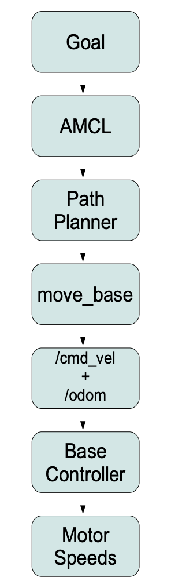

# 7.2 Уровни управления движением

Управление мобильным роботом может осуществляться на нескольких уровнях, и ROS предоставляет методы для большинства из них. Эти уровни представляют различные степени абстракции, начиная с прямого управления двигателями и заканчивая планированием пути и SLAM \(одновременная локализация и картирование\).

#### _**7.2.1 Моторы, Колеса и Кодеры**_ 

Большинство роботов с дифференциальным приводом, использующих ROS, используют датчики на двигателях или колесах привода. Кодер регистрирует определенное количество тактов \(обычно сотни или даже тысячи\) за оборот соответствующего колеса. Зная диаметр колес и расстояние между ними, отметки энкодера можно преобразовать в пройденное расстояние в метрах или угол поворота в радианах. Чтобы вычислить скорость, эти значения просто делятся на временной интервал между измерениями. 

Эти данные о внутреннем движении все вместе известны как **одометрия**, и ROS интенсивно использует их, как мы увидим. Это помогает, если у вашего робота есть точные и надежные кодеры, но данные колеса могут быть увеличены с использованием других источников. Например, оригинальный TurtleBot использует одноосный гироскоп, чтобы обеспечить дополнительную меру вращательного движения робота, так как кодеры iRobot Create заметно неточны во время вращения. 

Важно помнить, что независимо от того, сколько источников данных об одометрии используется, фактическое положение и скорость робота в мире могут \(и, вероятно, будут\) отличаться от значений, сообщаемых одометрией. Степень расхождения будет варьироваться в зависимости от условий окружающей среды и надежности источников одометрии. 

#### _**7.2.2 Контроллеры и драйверы двигателей**_

 На самом низком уровне управления движением нам нужен драйвер для контроллера мотора робота, который может вращать ведущие колеса с желаемой скоростью, обычно используя внутренние единицы, такие как число импульсов энкодера в секунду или процент от максимальной скорости. За исключением Willow Garage PR2 и TurtleBot, основные пакеты ROS не включают драйверы для определенных контроллеров двигателя. Однако ряд сторонних разработчиков ROS опубликовали драйверы для некоторых наиболее популярных контроллеров и / или роботов, таких как [Arduino](http://wiki.ros.org/ros_arduino_bridge), [ArbotiX](http://wiki.ros.org/arbotix), [Serializer](http://wiki.ros.org/serializer), [Element](http://wiki.ros.org/element), [LEGO® NXT](http://wiki.ros.org/Robots/NXT) и [Rovio](http://wiki.ros.org/rovio). \(Для более полного списка поддерживаемых платформ см. [Роботы, использующие ROS](http://wiki.ros.org/Robots).\) 

#### _**7.2.3 Базовый контроллер ROS**_ 

На следующем уровне абстракции желаемая скорость робота указывается в реальных единицах измерения, таких как метры и радианы в секунду. Также распространено использовать некоторую форму контроля PID. PID расшифровывается как «Пропорционально-интегральная производная» и носит так называемое название, поскольку алгоритм управления корректирует скорости вращения колес, основываясь не только на разнице \(пропорциональной\) погрешности между фактической и требуемой скоростью, но также на производной и интегральной по времени. Вы можете узнать больше о PID-контроле в [Википедии](http://en.wikipedia.org/wiki/PID_controller). Для наших целей нам просто нужно знать, что контроллер сделает все возможное, чтобы переместить робота так, как мы просили. 

Драйвер и PID-контроллер обычно объединяются в одном узле ROS, называемом базовым контроллером. Базовый контроллер всегда должен работать на компьютере, подключенном непосредственно к контроллеру двигателя, и обычно является одним из первых узлов, запускаемых при запуске робота. В Gazebo также можно смоделировать ряд базовых контроллеров, включая [TurtleBot](http://wiki.ros.org/turtlebot_simulator), [PR2](http://wiki.ros.org/pr2_simulator/Tutorials) и [Erratic](http://wiki.ros.org/erratic_robot).

Узел базового контроллера обычно публикует данные одометрии в теме / odom и прослушивает команды движения в теме / cmd\_vel. В то же время узел контроллера обычно \(но не всегда\) публикует преобразование из кадра / odom в базовый кадр - либо / base\_linkor / base\_footprint. В основном «не всегда», потому что некоторые роботы, такие как TurtleBot, используют пакет [robot\_pose\_ekf](http://ros.org/wiki/robot_pose_ekf), чтобы объединить одометрию колеса и данные гироскопа, чтобы получить более точную оценку положения и ориентации робота. В этом случае это узел robot\_pose\_ekf, который публикует преобразование из / odomto / base\_footprint. \(Therobot\_pose\_ekfpackageimplementsan Расширенный фильтр Калмана, о котором вы можете прочитать на вики-странице, на которую ссылается выше.\) 

Как только у нас есть базовый контроллер для нашего робота, ROS предоставляет инструменты, необходимые для выдачи команд движения либо из командной строки, либо с помощью других узлов ROS для публикации этих команд на основе плана более высокого уровня. На этом уровне не имеет значения, какое оборудование мы используем для нашего базового контроллера: наше программирование может фокусироваться исключительно на желаемых линейных и угловых скоростях в реальных единицах измерения, и любой код, который мы пишем, должен работать на любом базовом контроллере с интерфейсом ROS 

####  _**7.2.4 Кадровое движение с использованием пакета ROS move\_base**_

На следующем уровне абстракции ROS предоставляет пакет [move\_base](http://wiki.ros.org/move_base), который позволяет нам определять целевую позицию и ориентацию робота относительно некоторой системы отсчета; Затем move\_base попытается переместить робота к цели, избегая при этом препятствий. Пакет move\_base является очень сложным планировщиком пути и объединяет данные одометрии с локальными и глобальными картами затрат при выборе пути для робота. Он также контролирует линейные и угловые скорости и ускорения автоматически на основе минимальных и максимальных значений, которые мы устанавливаем в файлах конфигурации. 

#### _**7.2.5 SLAM с использованием пакетов gmapping и amcl ROS**_ 

На еще более высоком уровне ROS позволяет нашему роботу создавать карту своего окружения с помощью пакета SLAM [gmapping](http://wiki.ros.org/gmapping). Процесс картирования работает лучше всего с использованием лазерного сканера, но также может быть выполнен с использованием глубинной камеры Kinect или Asus Xtion для обеспечения имитации лазерного сканирования. Если у вас есть TurtleBot, [метапакет TurtleBot](http://ros.org/wiki/Robots/TurtleBot) включает в себя все инструменты, необходимые для SLAM. 

Как только карта среды становится доступной, ROS предоставляет пакет [amcl](http://wiki.ros.org/amcl) \(адаптивная локализация Монте-Карло\) для автоматической локализации робота на основе его текущих данных сканирования и одометрии. Это позволяет оператору указывать и нажимать на любое место на карте, и робот найдет путь туда, избегая препятствий. \(Для превосходного введения в математику, лежащую в основе SLAM, посмотрите онлайн-курс Себастьяна Труна по [искусственному интеллекту](http://www.udacity.com/overview/Course/cs373/CourseRev/apr2012) на Udacity.\)

#### _**7.2.6 Семантические цели**_

 Наконец, на самом высоком уровне абстракции цели движения определяются семантически, например, «пойти на кухню и принести мне пиво» или просто «принести мне пиво». В этом случае семантическая цель должна быть проанализирована и преобразована в серию действий. Для действий, требующих перемещения робота в определенное местоположение, каждое местоположение может быть передано на уровни локализации и планирования пути для реализации. Хотя это выходит за рамки этого тома, для решения этой задачи доступно несколько пакетов ROS, в том числе [smach](http://wiki.ros.org/executive_smach), [деревья поведения](http://wiki.ros.org/pi_trees), [executive\_teer](http://wiki.ros.org/executive_teer) и [knowrob](http://wiki.ros.org/knowrob). \(Оба дерева smach и поведения описаны в [томе 2](http://www.pirobot.org/wordpress/) серии ROS By Example.\)

#### _**7.2.7 Сводка**_

 Таким образом, наша иерархия управления движением выглядит примерно так:

В этой и следующей главе мы узнаем, как использовать эти уровни управления движением. Но прежде чем мы сможем понять более мощные функции, предоставляемые move\_base, gmapping и amcl, нам нужно начать с основ.

