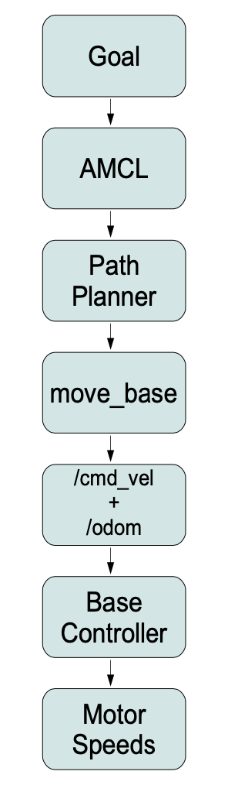

# 7.2.7 Сводка

 Таким образом, наша иерархия управления движением выглядит примерно так:

В этой и следующей главе мы узнаем, как использовать эти уровни управления движением. Но прежде чем мы сможем понять более мощные функции, предоставляемые move\_base, gmapping и amcl, нам нужно начать с основ.

