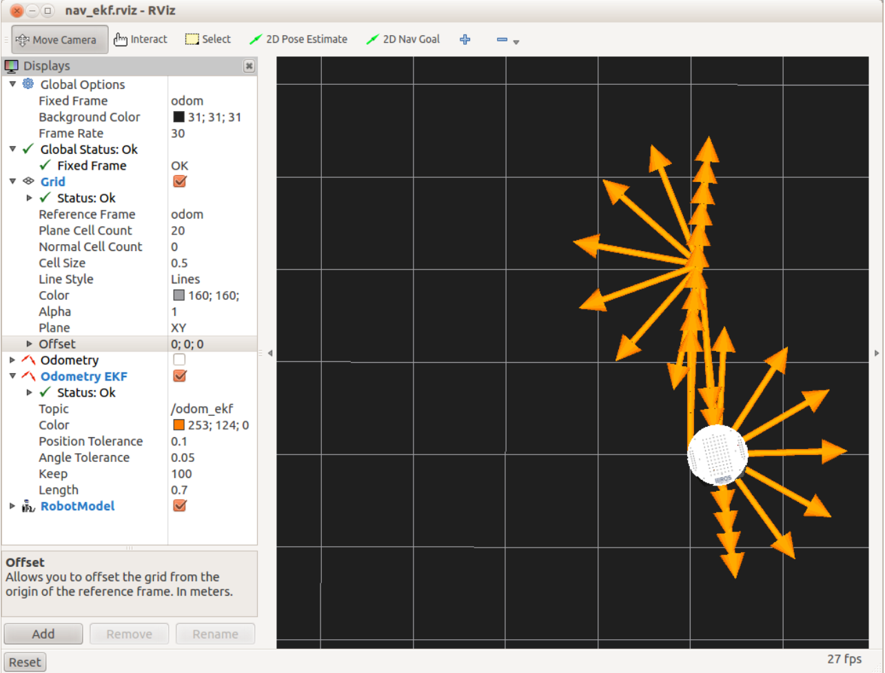

# 7.6 Публикация твист-сообщений от узла ROS

До сих пор мы перемещали нашего робота из командной строки, но большую часть времени вы будете полагаться на узел ROS для публикации соответствующих сообщений Twist. В качестве простого примера, предположим, что вы хотите запрограммировать робота, чтобы он перемещался на 1,0 метра вперед, поворачивался на 180 градусов, а затем возвращался к начальной точке. Мы попытаемся выполнить эту задачу несколькими различными способами, которые хорошо иллюстрируют различные уровни управления движением в ROS.

#### _**7.6.1 Оценка расстояния и поворота с использованием времени и скорости**_ <a id="7-6-1-ocenka-rasstoyaniya-i-povorota-s-ispolzovaniem-vremeni-i-skorosti"></a>

Нашей первой попыткой будет использование синхронизированных команд Twist, чтобы переместить робота на определенное расстояние вперед, повернуть на 180 градусов, а затем снова продвинуться вперед в течение того же времени и на той же скорости, где, как мы надеемся, он окажется там, где и начался. Наконец, мы повернем робота еще на 180 градусов, чтобы соответствовать исходной ориентации.

Сценарий можно найти в файле timed\_out\_and\_back.py в подкаталоге rbx1\_nav / node. Прежде чем смотреть на код, давайте попробуем его в симуляторе ArbotiX.

#### _7.6.2. Время и время в симуляторе ArbotiX_ <a id="7-6-2-vremya-i-vremya-v-simulyatore-arbotix"></a>

Чтобы убедиться, что поддельный Turtlebot перемещен в начальную точку, используйте Ctrl-C, чтобы завершить запуск файла поддельного Turtlebot, если он уже запущен, а затем снова вызовите его с помощью команды:

```text
$ roslaunch rbx1_bringup fake_turtlebot.launch
```

\(При желании замените файл fake\_turtlebot.launch файлом для робота Pi или вашего собственного робота. Это не повлияет на результаты.\)

Если RViz еще не запущен, запустите его сейчас:

```text
$ rosrun rviz rviz -d `rospack find rbx1_nav`/sim.rviz
```

или нажмите кнопку «Сброс», чтобы удалить все стрелки одометрии из предыдущего раздела.

Наконец, запустите узел timed\_out\_and\_back.py:

```text
$ rosrun rbx1_nav timed_out_and_back.py
```

Надеемся, что RViz покажет, как ваш робот выполняет маневр в обратном направлении, и конечный результат будет выглядеть примерно так:


Большие стрелки представляют положение и ориентацию робота в различных точках вдоль его траектории, о чем сообщает внутренняя \(поддельная\) внутренняя одометрия робота. Мы узнаем, как использовать эту информацию об одометрии в следующих нескольких разделах.

Пока что все выглядит довольно хорошо в идеальном симуляторе. Но прежде чем попробовать это на реальном роботе, давайте посмотрим на код.

#### _7.6.3. Скрипт с выдержкой времени и обратно_ <a id="7-6-3-skript-s-vyderzhkoi-vremeni-i-obratno"></a>

Вот полный скрипт для тайм-аута и обратного узла. После листинга мы будем разбивать его на более мелкие части.

Ссылка на источник: [timed\_out\_and\_back.py](https://github.com/pirobot/rbx1/blob/indigo-devel/rbx1_nav/nodes/timed_out_and_back.py)​

```text
#!/usr/bin/env pythonimport rospyfrom geometry_msgs.msg import Twist from math import piclass OutAndBack(): def __init__(self):        # Give the node a namerospy.init_node('out_and_back', anonymous=False)# Set rospy to execute a shutdown function when exiting rospy.on_shutdown(self.shutdown)  # Publisher to control the robot's speed self.cmd_vel = rospy.Publisher('/cmd_vel', Twist, queue_size=5)​ # How fast will we update the robot's movement? rate = 50​ # Set the equivalent ROS rate variable r = rospy.Rate(rate)​ # Set the forward linear speed to 0.2 meters per second linear_speed = 0.2​ # Set the travel distance to 1.0 meters goal_distance = 1.0​ # How long should it take us to get there? linear_duration = goal_distance / linear_speed​ # Set the rotation speed to 1.0 radians per second angular_speed = 1.0​ # Set the rotation angle to Pi radians (180 degrees) goal_angle = pi​ # How long should it take to rotate? angular_duration = goal_angle / angular_speed​ # Loop through the two legs of the trip for i in range(2): # Initialize the movement command move_cmd = Twist()​ # Set the forward speed move_cmd.linear.x = linear_speed​ # Move forward for a time to go 1 meter ticks = int(linear_duration * rate)​ for t in range(ticks): self.cmd_vel.publish(move_cmd) r.sleep()​ # Stop the robot before the rotation move_cmd = Twist() self.cmd_vel.publish(move_cmd) rospy.sleep(1)​ # Now rotate left roughly 180 degrees 63 # Set the angular speed move_cmd.angular.z = angular_speed​ # Rotate for a time to go 180 degrees ticks = int(goal_angle * rate)for t in range(ticks): self.cmd_vel.publish(move_cmd) r.sleep()            # Stop the robot before the next legmove_cmd = Twist() self.cmd_vel.publish(move_cmd) rospy.sleep(1)        # Stop the robotself.cmd_vel.publish(Twist())def shutdown(self):# Always stop the robot when shutting down the node. rospy.loginfo("Stopping the robot...") self.cmd_vel.publish(Twist())rospy.sleep(1)if __name__ == '__main__': try:        OutAndBack()    except:rospy.loginfo("Out-and-Back node terminated.")
```

Так как это наш первый скрипт, давайте посмотрим на него построчно, начиная сверху:

```text
#!/usr/bin/env python import rospy
```

Если вы делали Учебники для начинающих ROS в Python, вы уже знаете, что все наши узлы ROS начинаются с этих двух строк. Первая строка гарантирует, что программа будет работать как скрипт Python, а вторая импортирует основную библиотеку ROS для Python.

```text
from geometry_msgs.msg import Twistfrom math import pi
```

Здесь мы позаботимся о любом другом импорте, который нам нужен для скрипта. В этом случае нам понадобится тип сообщения Twist из пакета ROS geometry\_msgs и константа pi из математического модуля Python. Обратите внимание, что общий источник ошибок при импорте - забыть включить необходимую строку ROS в файл package.xml вашего пакета. В этом случае наш файл package.xml должен содержать строку:

> &lt;run\_depend&gt;geometry\_msgs&lt;/run\_depend&gt;

так что мы можем импортировать Twist из geometry\_msgs.msg.

```text
class OutAndBack():def __init__(self):
```

Здесь мы начинаем основную часть нашего узла ROS, определяя его как класс Python вместе со стандартной линией инициализации класса.

```text
# Give the node a namerospy.init_node('out_and_back', anonymous=False)# Set rospy to execute a shutdown function when exitingrospy.on_shutdown(self.shutdown)
```

Каждый узел ROS требует вызова rospy.init\_node \(\), и мы также устанавливаем обратный вызов для функции on\_shutdown \(\), чтобы мы могли выполнить любую необходимую очистку, когда сценарий завершается, например когда пользователь нажимает Ctrl-C. В случае мобильного робота самая важная задача очистки - остановить робота! Мы увидим, как это сделать позже в скрипте.

```text
# Publisher to control the robot's speedself.cmd_vel = rospy.Publisher('/cmd_vel', Twist, queue_size=5)# How fast will we update the robot's movement?rate = 50# Set the equivalent ROS rate variabler = rospy.Rate(rate)
```

Здесь мы определяем нашего издателя ROS для отправки команд Twist в раздел / cmd\_vel. Мы также устанавливаем скорость, с которой мы хотим обновить движение робота, 50 раз в секунду, а параметр queue\_size равным 5.

Параметр queue\_size был введен в ROS Hydro и будет обязательным в ROS Jade. В ROS Indigo ваш код выдаст предупреждение, если издатель инициализируется без этого параметра. Вы можете узнать больше о параметре queue\_size в ROS Wiki. Самый важный факт, который нужно иметь в виду, это то, что если этот параметр не указан или не установлен в значение «Нет», издатель будет вести себя синхронно. Это означает, что если имеется несколько подписчиков на тему издателя, и один из подписчиков зависает - например, он находится на другом конце ненадежного беспроводного соединения - тогда публикация будет блокировать всех подписчиков этой темы, пока подписчик не зависнет возвращается к жизни. Как правило, это нежелательный результат. Установка для параметра queue\_size числового значения приводит к тому, что издатель ведет себя асинхронно, так что каждый подписчик получает сообщения в отдельном потоке без подписчика и блокирует всю систему.

```text
# Set the forward linear speed to 0.2 meters per secondlinear_speed = 0.2# Set the travel distance to 1.0 metersgoal_distance = 1.0# How long should it take us to get there?linear_duration = linear_distance / linear_speed
```

Мы инициализируем скорость движения вперед относительно безопасную 0,2 метра в секунду и целевое расстояние до 1,0 метра. Затем мы вычисляем, сколько времени это займет.

```text
# Set the rotation speed to 1.0 radians per secondangular_speed = 1.0# Set the rotation angle to Pi radians (180 degrees)goal_angle = pi# How long should it take to rotate?angular_duration = angular_distance / angular_speed
```

Аналогично, мы устанавливаем скорость вращения 1,0 радиан в секунду, а целевой угол - 180 градусов или Pi радиан.

```text
# Loop through the two legs of the tripfor i in range(2):# Initialize the movement commandmove_cmd = Twist()# Set the forward speedmove_cmd.linear.x = linear_speed# Move forward for a time to go the desired distanceticks = int(linear_duration * rate)for t in range(ticks):self.cmd_vel.publish(move_cmd)r.sleep()
```

Это петля, которая фактически перемещает робота - один цикл для каждой из двух ног. Напомним, что некоторые роботы требуют, чтобы сообщение Twist постоянно публиковалось, чтобы оно продолжало двигаться. Поэтому, чтобы продвинуть робота вперед метры linear\_distance со скоростью метра linear\_speed в секунду, мы публикуем сообщение move\_cmd каждые 1 раз в секунду в течение соответствующей продолжительности. Выражение r.sleep \(\) является сокращением для rospy.sleep \(1 / скорость\), так как мы определили переменную r = rospy.Rate \(скорость\).

```text
# Now rotate left roughly 180 degrees 63# Set the angular speedmove_cmd.angular.z = angular_speed# Rotate for a time to go 180 degreesticks = int(goal_angle * rate)for t in range(ticks):self.cmd_vel.publish(move_cmd)r.sleep()
```

Во второй части цикла мы вращаем робота со скоростью angular\_speed радиан в секунду в течение соответствующей продолжительности \(в данном случае Pi секунд\), которая должна дать 180 градусов.

```text
# Stop the robot.self.cmd_vel.publish(Twist())
```

Когда робот завершил обратный путь, мы останавливаем его, публикуя пустое сообщение Twist \(все поля равны 0\).

```text
def shutdown(self):# Always stop the robot when shutting down the node.rospy.loginfo("Stopping the robot...")self.cmd_vel.publish(Twist())rospy.sleep(1)
```

Это наша функция обратного вызова выключения. Если выполнение сценария прекращается по какой-либо причине, мы останавливаем робота, публикуя пустое сообщение Twist.

```text
if __name__ == '__main__': try:OutAndBack()except rospy.ROSInterruptException:rospy.loginfo("Out-and-Back node terminated.")
```

Наконец, это стандартный блок Python для запуска скрипта. Мы просто создаем экземпляр класса OutAndBack, который запускает скрипт \(и робота\).

#### _7.6.4 Тайм-аут и обратно с использованием реального робота_ <a id="7-6-4-taim-aut-i-obratno-s-ispolzovaniem-realnogo-robota"></a>

Если у вас есть такой робот, как TurtleBot, вы можете попробовать скрипт timed\_out\_and\_back.py в реальном мире. Помните, что мы используем только время и скорость для оценки расстояния и углов поворота. Таким образом, мы ожидаем, что инерция робота вызовет изменения по сравнению с идеальной симуляцией ArbotiX \(которая, как вы помните, не моделирует физику\).

Во-первых, прекратите любые беговые симуляции. Затем убедитесь, что у вашего робота достаточно места для работы - по крайней мере, на 1,5 метра впереди и на метр с каждой стороны. Затем откройте файл запуска запуска вашего робота. Если у вас есть оригинальный TurtleBot \(база iRobot Create\), вставьте ssh в ноутбук робота и запустите:

```text
$ roslaunch rbx1_bringup turtlebot_minimal_create.launch
```

Или используйте свой собственный файл запуска, если вы создали его для хранения параметров калибровки.

Мы также будем использовать вспомогательный скрипт, чтобы видеть комбинированную рамку одометрии TurtleBot в RViz. \(Это станет понятнее в следующем разделе.\) Вы можете пропустить это, если не используете TurtleBot. Этот файл запуска должен быть запущен на ноутбуке TurtleBot с помощью другого ssh-терминала:

```text
$ roslaunch rbx1_bringup odom_ekf.launch
```

Далее мы собираемся настроить RViz для отображения комбинированных данных одометрии \(кодеры + гироскоп\), а не / odom, которые только показывают кодовые данные. Если вы уже работали с предыдущим тестом, вы можете просто отменить проверку дисплея Odometry и проверить экран EKF Odometry, а затем пропустить следующий шаг.

Если RViz еще не запущен, запустите его сейчас на рабочей станции с помощью файла конфигурации nav\_ekf. Этот файл просто предварительно выбирает тему / odom\_ekf для отображения комбинированных данных одометрии:

```text
$ rosrun rviz rviz -d `rospack find rbx1_nav`/nav_ekf.rvizЕдинственная разница между этой конфигурацией и предыдущей состоит в том, что мы теперь отображаем комбинированные данные одометрии в теме / odom_ekf, а не только данные колесного энкодера, опубликованные в теме / odom. Вы можете проверить оба дисплея, если хотите сравнить два.
```

Наконец, мы запускаем скрипт out и back, как и раньше. Обратите внимание, что самому сценарию не важно, выполняем ли мы симуляцию или управляем реальным роботом. Он просто публикует два сообщения в / cmd\_veltopicforany, которые могут быть изменены. Это один из примеров того, как ROS позволяет абстрагироваться от нижних уровней иерархии управления движением. Вы можете запустить следующую команду на своей рабочей станции или на ноутбуке робота после входа в систему с помощью ssh:

```text
$ rosrun rbx1_nav timed_out_and_back.py
```

Вот результат для моего собственного TurtleBot при работе на ковре с низким слоем:



Как видно из рисунка, робот не оказался очень близко к исходной позиции. Прежде всего, он не прошел достаточно далеко, прежде чем развернуться \(квадраты сетки находятся на расстоянии 0,5 метра\). Затем он не повернул на 180 градусов, прежде чем отправиться назад. В результате робот находится примерно в 0,5 м слева от начальной точки и ориентирован в неправильном направлении.

К счастью, данные, которые нам нужны, чтобы исправить проблему, смотрят нам прямо в глаза. Большие стрелки одометрии на изображении выше указывают положение и ориентацию робота в соответствии с его внутренней одометрией. Другими словами, робот «знает», что он испортил, но мы несправедливо помешали ему, не используя данные одометрии в нашем скрипте. Хотя данные одометрии не будут точно соответствовать реальному движению, они должны дать нам лучший результат, если мы их используем.[  
](https://ritka.gitbook.io/translate-book/untitled-18)

