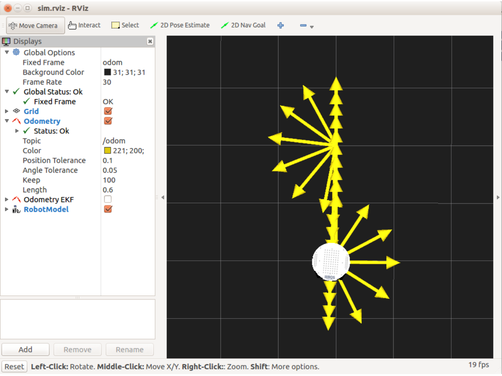

# 7.8 Туда и обратно, используя одометрию

Теперь, когда мы понимаем, как информация об одометрии представлена в ROS, мы можем быть более точными в отношении перемещения нашего робота в прямом и обратном направлении. Вместо того, чтобы угадывать расстояния и углы на основе времени и скорости, наш следующий скрипт будет отслеживать положение и ориентацию робота, как сообщается в результате преобразования между кадрами / odom и / base\_link.

Новый файл называется odom\_out\_and\_back.py в каталоге rbx1\_nav / node. Прежде чем смотреть на код, давайте сравним результаты между симулятором и реальным роботом.

#### _7.8.1 Одометрия на выходе и обратно в симуляторе ArbotiX_

Если у вас уже запущен симулированный робот, сначала нажмите Ctrl-C, чтобы мы могли начать измерения одометрии с нуля. Затем снова вызовите смоделированного робота, запустите RViz, затем запустите сценарий odom\_out\_and\_back.py следующим образом:

```text
$ roslaunch rbx1_bringup fake_turtlebot.launch
$ rosrun rviz rviz -d `rospack find rbx1_nav`/sim.rviz
$ rosrun rbx1_nav odom_out_and_back.py
```

Типичный результат показан ниже:



Как видите, использование одометрии в идеальном симуляторе без физики дает в основном идеальные результаты. Это не должно быть ужасно удивительно. Так что же случится, когда мы попробуем это на реальном роботе?

#### _7.8.2. На основе одометрии и обратно с использованием реального робота_

Если у вас есть TurtleBot или другой ROS-совместимый робот, вы можете попробовать реальный сценарий на основе одометрии в реальном мире.

Сначала убедитесь, что вы прекратили все запущенные симуляции. Затем откройте файл запуска запуска вашего робота. Для TurtleBot вы должны запустить:

```text
$ roslaunch rbx1_bringup turtlebot_minimal_create.launch
```

\(Или используйте свой собственный файл запуска, если вы создали его для хранения параметров калибровки.\)

Убедитесь, что у вашего робота достаточно места для работы - по крайней мере, на 1,5 метра впереди и на метр с каждой стороны.

Если вы используете TurtleBot, мы также запустим сценарий odom\_ekf.py \(входит в пакет rbx1\_bringup\), чтобы мы могли видеть комбинированный кадр одометрии TurtleBot в RViz. Вы можете пропустить это, если вы не используете TurtleBot. Этот файл запуска должен быть запущен на ноутбуке TurtleBot:

```text
$ roslaunch rbx1_bringup odom_ekf.launch
```

Если у вас уже запущен RViz из предыдущего теста, вы можете просто отменить проверку дисплея **Odometry** и проверить дисплей **EKF Odometry**, а затем пропустить следующий шаг.

Если RViz еще не запущен, запустите его сейчас на рабочей станции с помощью файла конфигурации nav\_ekf. Этот файл просто предварительно выбирает тему / odom\_ekf для отображения комбинированных данных одометрии:

```text
$ rosrun rviz rviz -d `rospack find rbx1_nav`/nav_ekf.rviz
```

Наконец, запустите сценарий одометрии, как мы это делали в симуляции. Вы можете запустить следующую команду на своей рабочей станции или на ноутбуке робота после входа в систему с помощью ssh:

```text
$ rosrun rbx1_nav odom_out_and_back.py
```

Вот результат для моего собственного TurtleBot при работе на ковре с низким слоем:


Как вы можете видеть на картинке, результат намного лучше, чем тайм-аут. Фактически, в реальном мире результат был даже лучше, чем показанный в RViz. \(Помните, что стрелки одометрии в RViz не будут точно совпадать с фактическим положением и ориентацией робота в реальном мире.\) В этом конкретном пробеге робот оказался на расстоянии менее 1 см от исходного положения и всего несколько градусов от правильной ориентации. Конечно, чтобы получить результаты, даже такие хорошие, вам нужно потратить некоторое время на тщательную калибровку одометрии вашего робота, как описано ранее.

#### _7.8.3. Сценарий «на спине» и «обратно»_

Вот теперь полный сценарий, основанный на одометрии. Встроенные комментарии должны сделать сценарий достаточно понятным, но мы опишем ключевые строки более подробно после перечисления.

Ссылка на источник: [odom\_out\_and\_back.py](https://github.com/pirobot/rbx1/blob/indigo-devel/rbx1_nav/nodes/odom_out_and_back.py)

```text
#!/usr/bin/env python
import rospy
from geometry_msgs.msg import Twist, Point, Quaternion
import tf
from rbx1_nav.transform_utils import quat_to_angle, normalize_angle
from math import radians, copysign, sqrt, pow, pi
class OutAndBack():
def __init__(self):
# Give the node a name
rospy.init_node('out_and_back', anonymous=False)
# Set rospy to execute a shutdown function when exiting
rospy.on_shutdown(self.shutdown)
# Publisher to control the robot's speed
self.cmd_vel = rospy.Publisher('/cmd_vel', Twist, queue_size=5)
# How fast will we update the robot's movement?
rate = 20
# Set the equivalent ROS rate variable
r = rospy.Rate(rate)
# Set the forward linear speed to 0.2 meters per second
linear_speed = 0.2
# Set the travel distance in meters
goal_distance = 1.0
# Set the rotation speed in radians per second
angular_speed = 1.0
# Set the angular tolerance in degrees converted to radians
angular_tolerance = radians(2.5)
# Set the rotation angle to Pi radians (180 degrees)
goal_angle = pi
# Initialize the tf listener
self.tf_listener = tf.TransformListener()
# Give tf some time to fill its buffer
rospy.sleep(2)
# Set the odom frame
self.odom_frame = '/odom'
# Find out if the robot uses /base_link or /base_footprint
try:
self.tf_listener.waitForTransform(self.odom_frame,
'/base_footprint', rospy.Time(), rospy.Duration(1.0))
'/base_link', rospy.Time(), rospy.Duration(1.0))
self.base_frame = '/base_link'
except (tf.Exception, tf.ConnectivityException, tf.LookupException):
self.base_frame = '/base_footprint'
except (tf.Exception, tf.ConnectivityException, tf.LookupException):
try: self.tf_listener.waitForTransform(self.odom_frame,
rospy.loginfo("Cannot find transform between /odom and /base_link or /base_footprint")
rospy.signal_shutdown("tf Exception")
# Initialize the position variable as a Point type
position = Point()
# Loop once for each leg of the trip
for i in range(2):
# Initialize the movement command
move_cmd = Twist()
# Set the movement command to forward motion
move_cmd.linear.x = linear_speed
# Get the starting position values
(position, rotation) = self.get_odom()
x_start = position.x
y_start = position.y
# Keep track of the distance traveled
distance = 0
# Enter the loop to move along a side
while distance < goal_distance and not rospy.is_shutdown():
# Publish the Twist message and sleep 1 cycle
self.cmd_vel.publish(move_cmd)
r.sleep() 88
# Get the current position
(position, rotation) = self.get_odom()
# Compute the Euclidean distance from the start
distance = sqrt(pow((position.x - x_start), 2) +
pow((position.y - y_start), 2))
# Stop the robot before the rotation
move_cmd = Twist()
self.cmd_vel.publish(move_cmd)
rospy.sleep(1)
# Set the movement command to a rotation
move_cmd.angular.z = angular_speed
# Track the last angle measured
last_angle = rotation
# Track how far we have turned
turn_angle = 0
while abs(turn_angle + angular_tolerance) < abs(goal_angle) and not rospy.is_shutdown():
# Publish the Twist message and sleep 1 cycle
self.cmd_vel.publish(move_cmd)
r.sleep()
# Get the current rotation
(position, rotation) = self.get_odom()
self.base_frame, rospy.Time(0))
except (tf.Exception, tf.ConnectivityException, tf.LookupException):
rospy.loginfo("TF Exception")
return
return (Point(*trans), quat_to_angle(Quaternion(*rot))) 142
def shutdown(self):
# Always stop the robot when shutting down the node.
rospy.loginfo("Stopping the robot...")
self.cmd_vel.publish(Twist())
rospy.sleep(1)
if __name__ == '__main__':
try:
    OutAndBack()
except:
rospy.loginfo("Out-and-Back node terminated.")
# Compute the amount of rotation since the last loop
delta_angle = normalize_angle(rotation - last_angle)
# Add to the running total
turn_angle += delta_angle last_angle = rotation
# Stop the robot before the next leg
move_cmd = Twist() self.cmd_vel.publish(move_cmd) rospy.sleep(1)
# Stop the robot for good
self.cmd_vel.publish(Twist())
def get_odom(self):
# Get the current transform between the odom and base frames try:
OutAndBack()
except:
rospy.loginfo("Out-and-Back node terminated.")
```

Давайте теперь посмотрим на ключевые строки в скрипте.

```text
from geometry_msgs.msg import Twist, Point, Quaternion
import tf
from rbx1_nav.transform_utils import quat_to_angle, normalize_angle
```

Нам понадобятся типы данных Twist, Point и Quaternion из пакета geometry\_msgs. Нам также понадобится библиотека tf для мониторинга преобразования между фреймами / odom и / base\_link \(или / base\_footprint\). Библиотека transform\_utils представляет собой небольшой модуль, который можно найти в каталоге rbx1\_nav / src / rbx1\_nav, и содержит несколько удобных функций, заимствованных из пакета TurtleBot. Функция quat\_to\_angle преобразует кватернион в угол Эйлера \(yaw\), а функция normalize\_angle устраняет неоднозначность между 180 и -180 градусами, а также 0 и 360 градусов.

```text
# Set the angular tolerance in degrees converted to radians
angular_tolerance = radians(2.5)
```

Здесь мы определяем angular\_tolerance для вращений. Причина в том, что с реальным роботом очень легко обойти вращение, и даже небольшая угловая ошибка может отвести робота подальше от следующего места. Опытным путем было обнаружено, что допуск около 2,5 градусов дает приемлемые результаты.

```text
# Initialize the tf listener
self.tf_listener = tf.TransformListener()
# Give tf some time to fill its buffer
rospy.sleep(2)
# Set the odom frame
self.odom_frame = '/odom'
# Find out if the robot uses /base_link or /base_footprint
try:
self.tf_listener.waitForTransform(self.odom_frame,
'/base_footprint', rospy.Time(), rospy.Duration(1.0))
'/base_link', rospy.Time(), rospy.Duration(1.0))
self.base_frame = '/base_link'
except (tf.Exception, tf.ConnectivityException, tf.LookupException):
self.base_frame = '/base_footprint'
except (tf.Exception, tf.ConnectivityException, tf.LookupException):
try: self.tf_listener.waitForTransform(self.odom_frame,
rospy.loginfo("Cannot find transform between /odom and /base_link or /base_footprint")
rospy.signal_shutdown("tf Exception")
```

Затем мы создаем объект TransformListener для мониторинга преобразования кадров. Обратите внимание, что tf требуется немного времени, чтобы заполнить буфер слушателя, поэтому мы добавляем вызов rospy.sleep \(2\). Чтобы получить положение и ориентацию робота, нам нужно преобразование между фреймом / odom и фреймом / base\_footprint, используемым TurtleBot, или фреймом / base\_link, используемым Pi Robot и Maxwell. Сначала мы проверяем фрейм / base\_footprint, и если мы его не найдем, мы тестируем кадр / base\_link. Результат сохраняется в переменной self.base\_frame для последующего использования в скрипте.

```text
for i in range(2):
# Initialize the movement command 
move_cmd = Twist()
```

Как и в случае с таймером «назад и обратно», мы проходим через два этапа поездки: сначала перемещаем робота на 1 метр вперед, затем поворачиваем его на 180 градусов.

```text
(position, rotation) = self.get_odom()
x_start = position.x
y_start = position.y
```

В начале каждого этапа мы записываем начальную позицию и ориентацию с помощью функции get\_odom \(\). Давайте посмотрим на это дальше, чтобы мы поняли, как это работает.

```text
self.base_frame, rospy.Time(0))
except (tf.Exception, tf.ConnectivityException, tf.LookupException): rospy.loginfo("TF Exception")
return
return (Point(*trans), quat_to_angle(Quaternion(*rot)))
def get_odom(self):
# Get the current transform between the odom and base frames try:
(trans, rot) = self.tf_listener.lookupTransform(self.odom_frame,
```

Функция get\_odom \(\) сначала использует объект tf\_listener для поиска текущего преобразования между одометрией и базовыми кадрами. Если есть проблема с поиском, мы выдаем исключение. В противном случае мы возвращаем точечное представление трансляции и представление квотернизации. Переменные \* infrontofthetransandrot - это нотация Python для передачи списка чисел в функцию, и мы используем его здесь, поскольку trans - это список координат x, y и z, а rot - список компонентов кватернионов x, y, z и w.

Теперь вернемся к основной части скрипта:

```text
# Keep track of the distance traveled
distance = 0
# Enter the loop to move along a side
while distance < goal_distance and not rospy.is_shutdown():
# Publish the Twist message and sleep 1 cycle
self.cmd_vel.publish(move_cmd)
r.sleep() 85
# Get the current position
(position, rotation) = self.get_odom()
# Compute the Euclidean distance from the start
distance = sqrt(pow((position.x - x_start), 2) +
pow((position.y - y_start), 2))
```

Это просто наша петля, чтобы двигать робота вперед, пока мы не пройдем 1,0 метра.

```text
# Track how far we have turned
turn_angle = 0
while abs(turn_angle + angular_tolerance) < abs(goal_angle) and not rospy.is_shutdown():
# Publish the Twist message and sleep for 1 cycle
self.cmd_vel.publish(move_cmd)
r.sleep()
# Get the current rotation
(position, rotation) = self.get_odom()
# Compute the amount of rotation since the last loop
delta_angle = normalize_angle(rotation - last_angle)
# Add to the running total
turn_angle += delta_angle
last_angle = rotation
```

И это наш цикл для поворота на 180 градусов в пределах углового допуска, который мы установили в начале сценария

#### 7.8.4 The/odom Topic versus the/odom Frame

Читателю может быть интересно, почему мы использовали TransformListener в предыдущем скрипте для доступа к информации об одометрии, а не просто для подписки на тему / odom. Причина в том, что данные, опубликованные по теме / odom, не всегда являются полной историей. Например, TurtleBot использует одноосный гироскоп для дополнительной оценки вращения робота. Это объединено с данными от колесных кодеров узлом robot\_pose\_ekf \(который запускается в файле запуска TurtleBot\), чтобы получить лучшую оценку вращения, чем один из источников в отдельности.

Однако узел robot\_pose\_ekf не публикует свои данные обратно в теме / odom, которая зарезервирована для данных колесного энкодера. Вместо этого он публикует его в теме / odom\_combined. Кроме того, данные публикуются не как сообщение одометрии, а как сообщение PoseWithCovarianceStamped. Тем не менее, он публикует преобразование из фрейма / odom в фрейм / base\_link \(или / base\_footprint\), который предоставляет необходимую нам информацию. В результате, как правило, безопаснее использовать tf для мониторинга преобразования между фреймами / odom и / base\_link \(или / base\_footprint\), чем полагаться на тему сообщения / odom.

В каталоге rbx1\_bringup / hosts вы найдете узел с именем odom\_ekf.py, который повторно публикует сообщение PoseWithCovarianceStamped, найденное в теме / odom\_combined, как сообщение типа Odometry в теме под названием / odom\_ekf. Это сделано только для того, чтобы мы могли просматривать темы / odom и / odom\_ekf в RViz, чтобы сравнить одометрию на основе колеса TurtleBot с комбинированной одометрией, включающей гироскопические данные.

