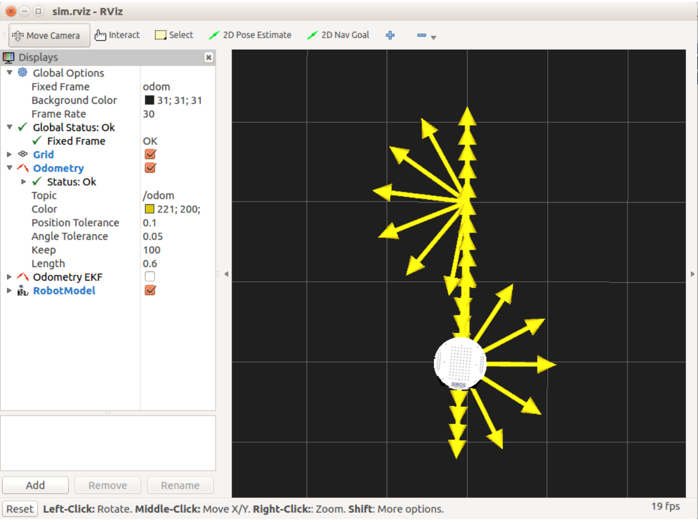

# 7.8.1 Одометрия на выходе и обратно в симуляторе ArbotiX

Если у вас уже запущен симулированный робот, сначала нажмите Ctrl-C, чтобы мы могли начать измерения одометрии с нуля. Затем снова вызовите смоделированного робота, запустите RViz, затем запустите сценарий odom\_out\_and\_back.py следующим образом:

```text
$ roslaunch rbx1_bringup fake_turtlebot.launch
$ rosrun rviz rviz -d `rospack find rbx1_nav`/sim.rviz
$ rosrun rbx1_nav odom_out_and_back.py
```

Типичный результат показан ниже:



Как видите, использование одометрии в идеальном симуляторе без физики дает в основном идеальные результаты. Это не должно быть ужасно удивительно. Так что же случится, когда мы попробуем это на реальном роботе?

