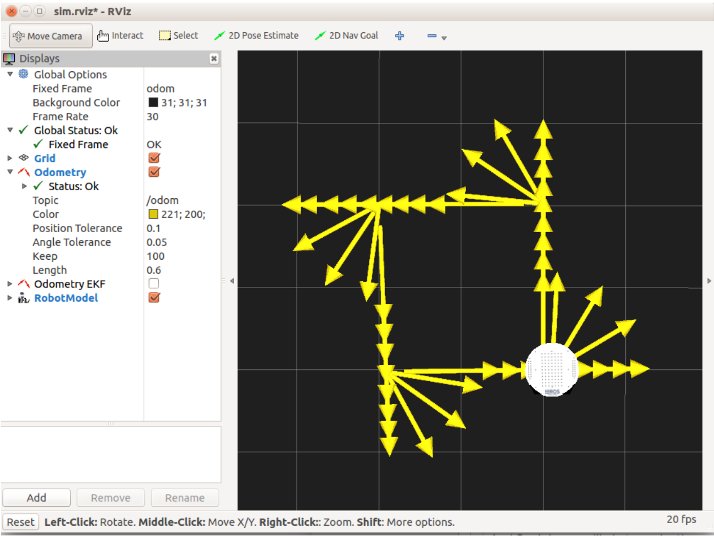
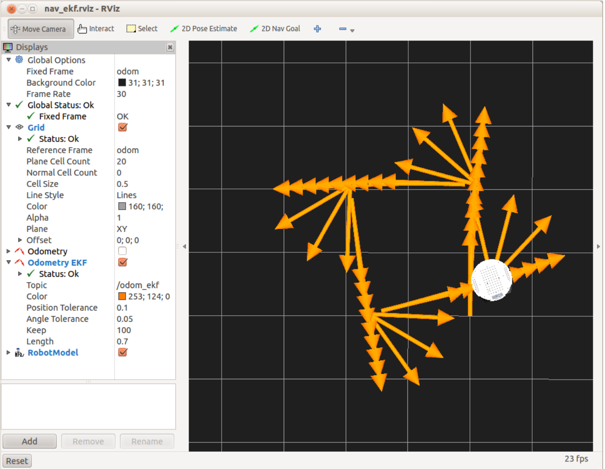

# 7.9 Навигация по квадрату с помощью одометрии

Как и в случае со скриптом на основе одометрии, мы будем отслеживать положение и ориентацию робота с помощью преобразования tf между фреймами / odom и / base\_link \(или / base\_footprint\). Однако на этот раз мы попытаемся переместить робота в квадрат, установив четыре точки маршрута, по одной на каждом углу. В конце пробега мы видим, насколько близко робот возвращается к исходной точке и ориентации. Давайте начнем с симуляции, а затем попробуем ее на реальном роботе.

#### _7.9.1 Навигация по квадрату в симуляторе ArbotiX_

Если у вас уже запущен симулятор TurtleBot или Pi Robot, сначала нажмите Ctrl-C, чтобы мы могли начать измерения одометрии с нуля. Затем снова вызовите смоделированного робота, запустите RViz, затем запустите скрипт nav\_square.py следующим образом:

```text
$ roslaunch rbx1_bringup fake_turtlebot.launch
$ rosrun rviz rviz -d `rospack find rbx1_nav`/sim.rviz
$ rosrun rbx1_nav nav_square.py
```

Типичный результат показан ниже:



Как и прежде, стрелки одометрии иллюстрируют направление движения робота в различных точках его маршрута. Как видите, квадрат не совсем выровнен по линиям сетки, но это неплохо.

#### _7.9.2 Навигация по квадрату с использованием реального робота_

Если у вас есть робот, попробуйте скрипт nav\_square прямо сейчас, чтобы увидеть, насколько хорошо он справляется с реальной одометрией. Сначала завершите все запущенные симулированные роботы, затем запустите файл \(ы\) запуска для вашего робота. Для TurtleBot вы должны запустить:

```text
$ roslaunch rbx1_bringup turtlebot_minimal_create.launch
```

\(Или используйте свой собственный файл запуска, если вы создали его для хранения параметров калибровки.\)

Убедитесь, что у вашего робота достаточно места для работы - по крайней мере, на 1,5 метра впереди с обеих сторон.

Если вы используете TurtleBot, нам также нужно запустить скрипт odom\_ekf.py, чтобы увидеть комбинированную рамку одометрии TurtleBot в RViz. Вы можете пропустить это, если вы не используете TurtleBot. Файл запуска должен быть запущен на ноутбуке TurtleBot:

```text
$ roslaunch rbx1_bringup odom_ekf.launch
```

Если RViz все еще работает на вашей рабочей станции, выключите его и верните обратно с помощью файла конфигурации ekf. В качестве альтернативы, просто снимите флажок с дисплея **Odometry** и проверьте дисплее **EKF Odometry**.

```text
$ rosrun rviz rviz -d `rospack find rbx1_nav`/nav_ekf.rviz
```

Наконец, снова запустите скрипт nav\_square.py:

```text
$ rosrun rbx1_nav nav_square.py
```

На следующем рисунке показаны результаты использования моего TurtleBot на ковре с низким слоем:



Как видите, результат не так уж и плох. В реальном мире робот оказался на расстоянии 11 см от начальной точки и примерно на 15 градусов от первоначальной ориентации. Но, конечно, если бы мы запустили сценарий второй раз без изменения положения робота, ошибка в исходной ориентации отбросила бы всю траекторию.

#### _7.9.3 nav\_square.pyScript_

Сценарий nav\_square.py почти идентичен сценарию на основе одометрии, который мы только что рассмотрели, поэтому здесь его отображать не будем. Единственное отличие состоит в том, что теперь мы отправляем робота по четырем 1-метровым ножкам с поворотом на 90 градусов вместо двух 1-метровых ножек с поворотом на 180 градусов. Вы можете посмотреть код по ссылке ниже или просмотреть свою собственную копию в каталоге rbx1\_nav / node.

Ссылка на источник:[ nav\_square.py](https://github.com/pirobot/rbx1/blob/indigo-devel/rbx1_nav/nodes/nav_square.py)

#### _7.9.4 Проблемы с Dead Reckoning_

Обработка навигации по курсу, основанная только на внутренних данных движения и без ссылки на внешние ориентиры, называется мертвым расчетом. Любой робот, который полностью полагается на безрассудную расплату за любой промежуток времени, в конечном итоге полностью потеряется. Корень проблемы в том, что даже небольшие ошибки в одометрии накапливаются со временем. Представьте, например, ошибку в 1 градус в предполагаемом направлении движения робота непосредственно перед тем, как он двинется прямо на 3 метра. В конце пробега робот будет иметь ошибку более 5 см в своем положении. Поскольку робот не знает, что он находится на расстоянии 5 см от предполагаемого пункта назначения, расчет следующего движения будет отключен на эту величину еще до того, как он начнется.

К счастью, роботы уже давно начали работать над различными способами включения наземных ориентиров или других внешних ссылок в навигацию роботов, и мы сделаем то же самое с ROS в главе о SLAM.

