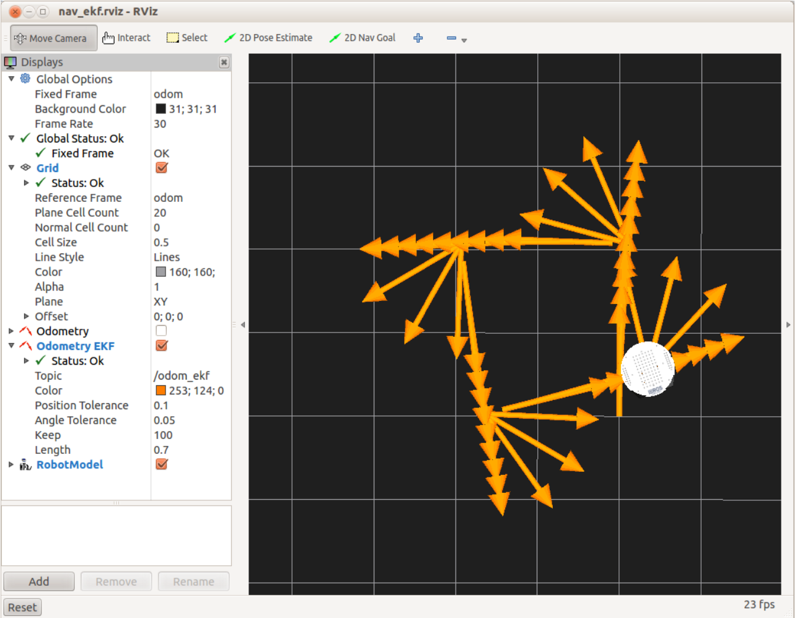

# 7.9.2 Навигация по квадрату с использованием реального робота

Если у вас есть робот, попробуйте скрипт nav\_square прямо сейчас, чтобы увидеть, насколько хорошо он справляется с реальной одометрией. Сначала завершите все запущенные симулированные роботы, затем запустите файл \(ы\) запуска для вашего робота. Для TurtleBot вы должны запустить:

```text
$ roslaunch rbx1_bringup turtlebot_minimal_create.launch
```

\(Или используйте свой собственный файл запуска, если вы создали его для хранения параметров калибровки.\)

Убедитесь, что у вашего робота достаточно места для работы - по крайней мере, на 1,5 метра впереди с обеих сторон.

Если вы используете TurtleBot, нам также нужно запустить скрипт odom\_ekf.py, чтобы увидеть комбинированную рамку одометрии TurtleBot в RViz. Вы можете пропустить это, если вы не используете TurtleBot. Файл запуска должен быть запущен на ноутбуке TurtleBot:

```text
$ roslaunch rbx1_bringup odom_ekf.launch
```

Если RViz все еще работает на вашей рабочей станции, выключите его и верните обратно с помощью файла конфигурации ekf. В качестве альтернативы, просто снимите флажок с дисплея **Odometry** и проверьте дисплее **EKF Odometry**.

```text
$ rosrun rviz rviz -d `rospack find rbx1_nav`/nav_ekf.rviz
```

Наконец, снова запустите скрипт nav\_square.py:

```text
$ rosrun rbx1_nav nav_square.py
```

На следующем рисунке показаны результаты использования моего TurtleBot на ковре с низким слоем:



Как видите, результат не так уж и плох. В реальном мире робот оказался на расстоянии 11 см от начальной точки и примерно на 15 градусов от первоначальной ориентации. Но, конечно, если бы мы запустили сценарий второй раз без изменения положения робота, ошибка в исходной ориентации отбросила бы всю траекторию.

